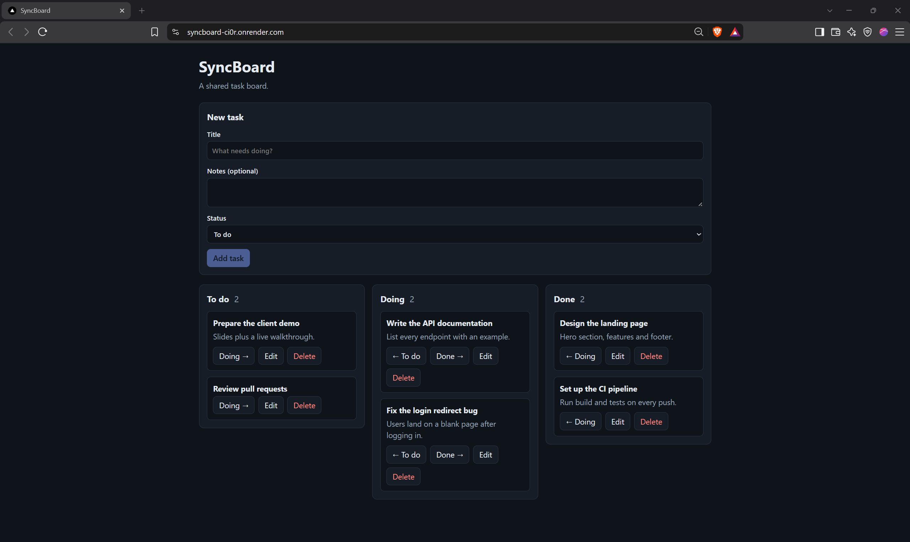

# SyncBoard

A shared task board. Create, edit, move and delete tasks across three
columns (To do, Doing, Done).

**Live demo:** https://syncboard-ci0r.onrender.com/
(Free hosting sleeps when idle, so the first load can take up to a minute.)

## Stack

- **Backend:** ASP.NET Core Web API (C#), EF Core with SQLite and migrations
- **Frontend:** Next.js (static export) written in TypeScript, served by the API
- **Packaging and hosting:** Docker, deployed on Render

## Run it (one command)

Requires Docker.

    docker compose up --build

Then open http://localhost:8080.

## Run it for development

Terminal 1 (API):

    cd server
    dotnet run

Terminal 2 (client), with `NEXT_PUBLIC_API_URL=http://localhost:8080`
in `client/.env.development`:

    cd client
    npm install
    npm run dev

Then open http://localhost:3000. See `.env.example` for the variables.

## Features

- REST API with full CRUD and correct status codes: 201, 400, 404, 409
- Server-side validation (title required, max length, status must be
  Todo, Doing or Done)
- SQLite database with versioned EF Core migrations
- Seed script: demo data is created automatically on startup
- Loading, empty and error states on every list and fetch
- Responsive layout: works at 375px wide and on desktop
- Client-side form validation with inline errors and a disabled submit

## Decisions and trade-offs

- **SQLite:** zero setup and enough for this scope. The free host has
  no persistent disk, so the file can reset when the service restarts.
  The seed script runs on every startup so the board is never empty.
- **One deployable:** Next.js is built to static files and served by
  the ASP.NET Core app, so there is a single URL and no CORS setup in
  production.
- **Version number on every task:** each edit sends the version it was
  based on, and the server returns 409 if the task changed in the
  meantime. This prevents silent overwrites.
- **Not included:** authentication, tests and CI.

## AI usage

I used Claude (Anthropic) as an assistant to plan the project and
generate code. I reviewed and ran everything, and I can explain each
part.